# UML DIAGRAMS - RECIPE DISCOVERY
## Tất cả các sơ đồ PlantUML cho báo cáo

> **Hướng dẫn sử dụng:**
> 1. Copy mã PlantUML
> 2. Paste vào https://www.plantuml.com/plantuml/uml/ để generate diagram
> 3. Download PNG/SVG để đưa vào báo cáo Word

---

## CHƯƠNG 2: CƠ SỞ LÝ THUYẾT

### Hình 2.1. Mô hình kiến trúc MVC của Recipe Discovery

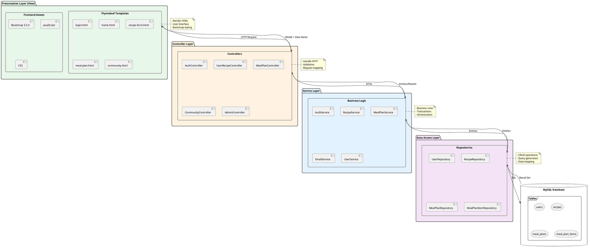

### Hình 2.2. Technology Stack của hệ thống

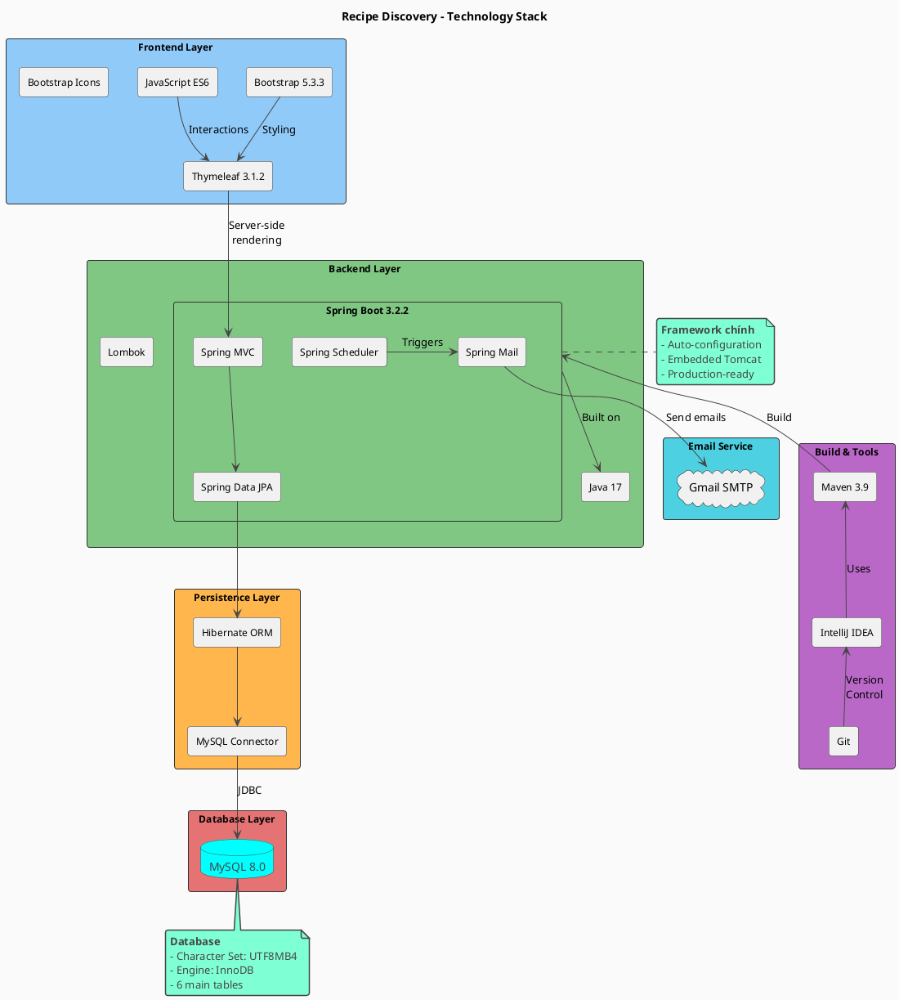

---

## CHƯƠNG 3: PHÂN TÍCH, THIẾT KẾ HỆ THỐNG

### Hình 3.1. Use Case Diagram Tổng quát

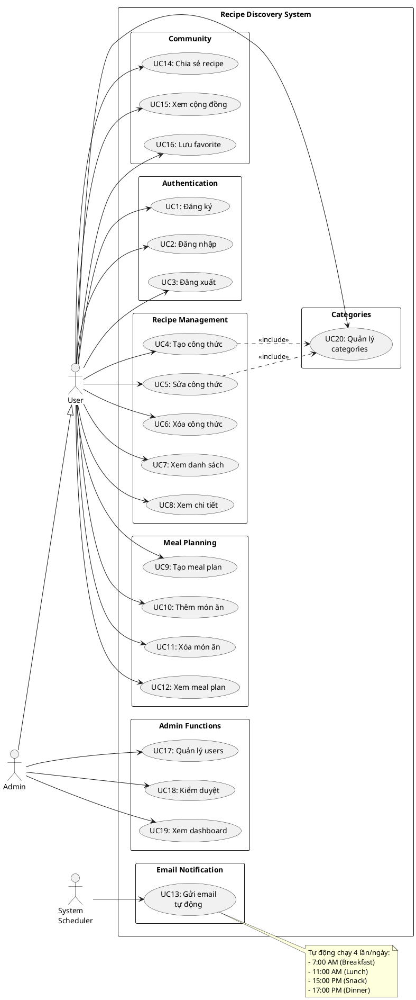

### Hình 3.2. Use Case UML của chức năng Đăng ký / Đăng nhập

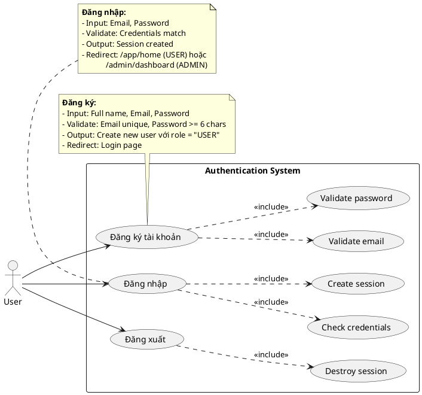

### Hình 3.3. Activity Diagram của chức năng Đăng nhập

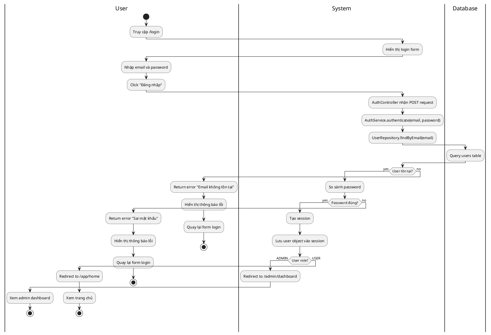

### Hình 3.3b. Activity Diagram của chức năng Đăng ký

```plantuml
@startuml
|User|
start

:Truy cập /register;

|System|
:Hiển thị register form;

|User|
:Nhập thông tin:
- Full name
- Email
- Password;

:Click "Đăng ký";

|System|
:AuthController nhận POST request;

:Validate input data;

if (Dữ liệu hợp lệ?) then (yes)
  :AuthService.register();
  
  :UserRepository.findByEmail(email);
  
  |Database|
  :Query users table;
  
  |System|
  if (Email đã tồn tại?) then (yes)
    :Return error "Email đã được sử dụng";
    
    |User|
    :Hiển thị thông báo lỗi;
    :Quay lại form register;
    stop
    
  else (no)
    :Tạo User entity mới;
    note right
      full_name: <input>
      email: <input>
      password: <input>
      role: "USER"
      status: "ACTIVE"
    end note
    
    |Database|
    :INSERT INTO users;
    
    if (Insert thành công?) then (yes)
      |System|
      :Redirect to /login;
      :Show success message
      "Đăng ký thành công!";
      
      |User|
      :Xem thông báo thành công;
      :Chuyển sang trang đăng nhập;
      stop
      
    else (no)
      |System|
      :Return error "Lỗi database";
      
      |User|
      :Hiển thị thông báo lỗi;
      stop
    endif
  endif
  
else (no)
  :Return validation errors;
  note right
    - Email không hợp lệ
    - Password quá ngắn (<6 chars)
    - Full name trống
  end note
  
  |User|
  :Hiển thị lỗi validation;
  :Sửa thông tin;
  stop
endif

@enduml
```

### Hình 3.4. Use Case UML của chức năng Quản lý công thức

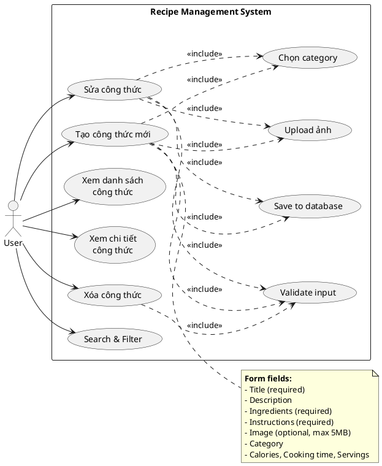

### Hình 3.5. Activity Diagram của chức năng Tạo công thức mới

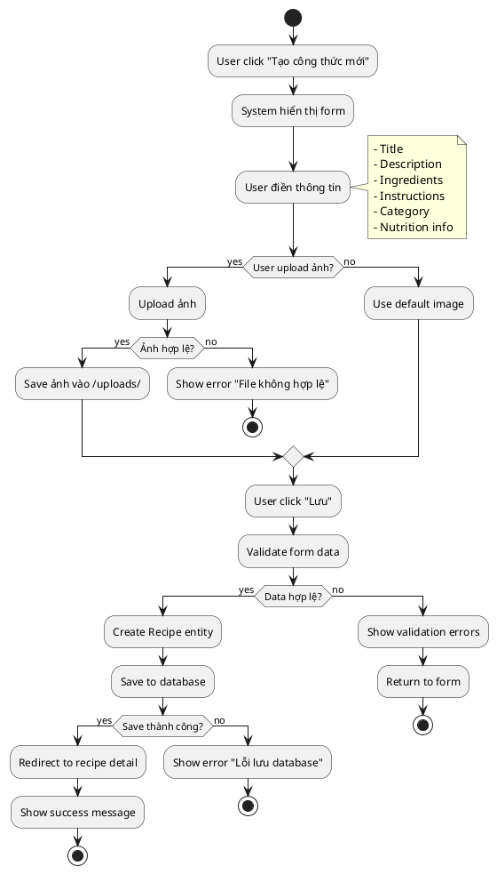

### Hình 3.6. Use Case UML của chức năng Meal Planning

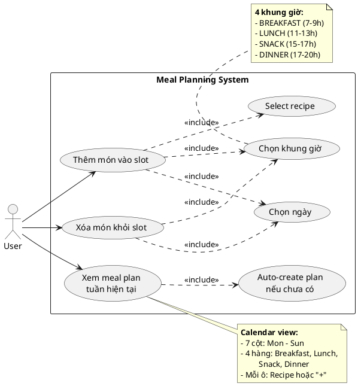

### Hình 3.7. Activity Diagram của chức năng Thêm món vào Meal Plan

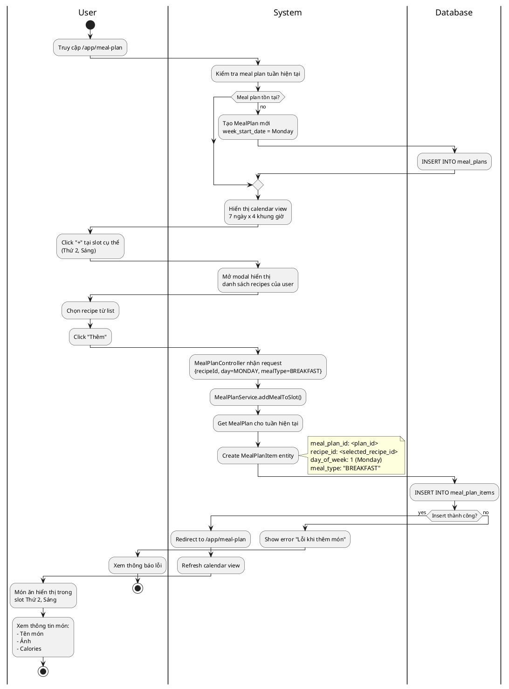

### Hình 3.8. Use Case UML của chức năng Email Notification

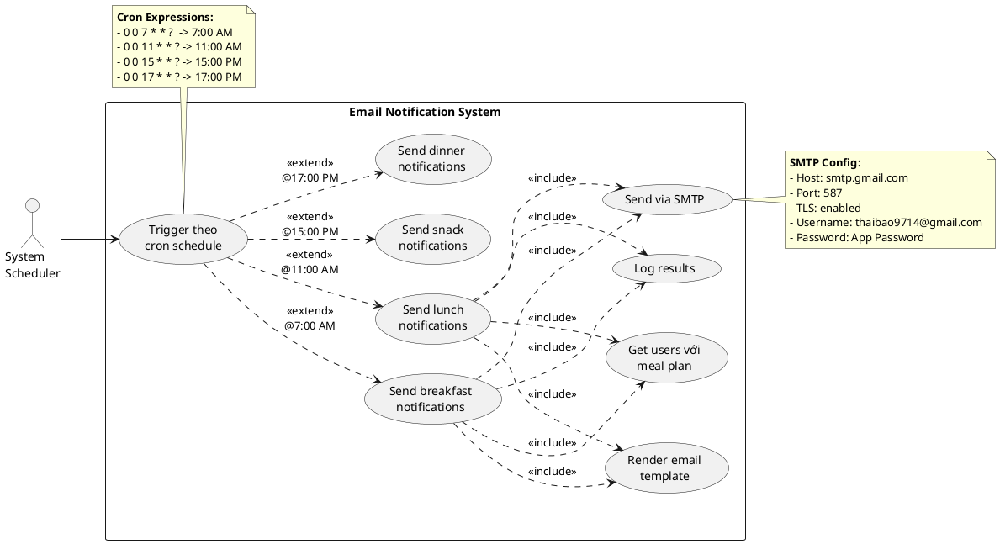

### Hình 3.9. Activity Diagram của Email Scheduler

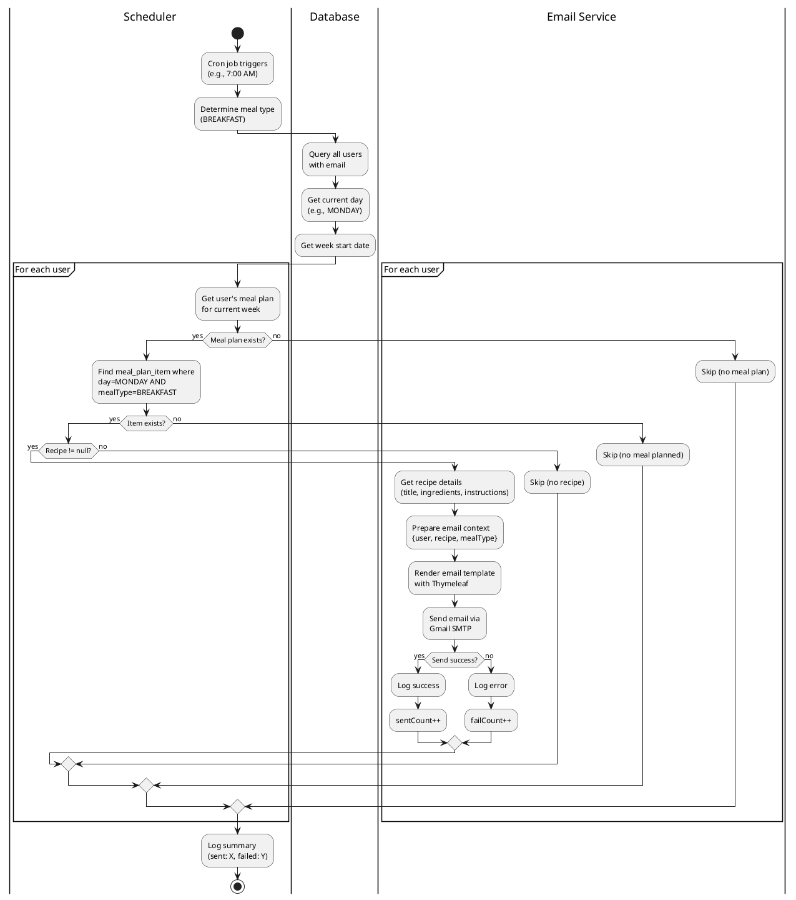

### Hình 3.10. Use Case UML của chức năng Community Sharing

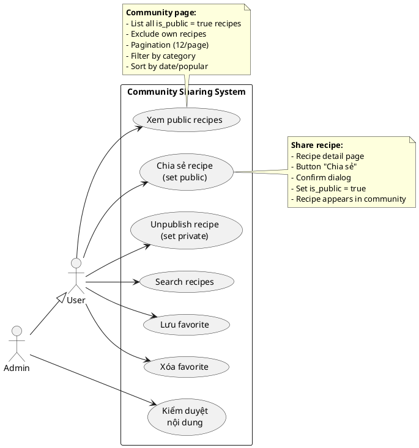

### Hình 3.11. Activity Diagram của chức năng Chia sẻ công thức

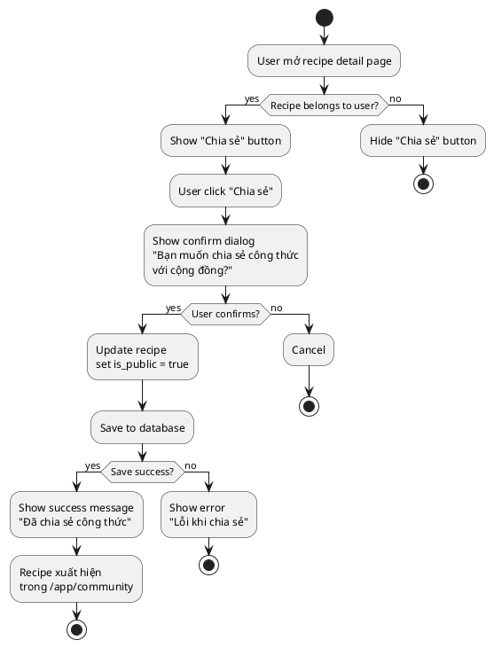

---

### Hình 3.12. Bảng users trong Cơ sở dữ liệu

```sql
-- Table structure for users
CREATE TABLE users (
  id BIGINT AUTO_INCREMENT PRIMARY KEY,
  full_name VARCHAR(100) NOT NULL,
  email VARCHAR(100) NOT NULL UNIQUE,
  password VARCHAR(255) NOT NULL,
  role VARCHAR(20) NOT NULL DEFAULT 'USER',
  avatar_url VARCHAR(500) DEFAULT 'https://ui-avatars.com/api/?name=User&background=4caf50&color=fff',
  note VARCHAR(255) NULL,
  status VARCHAR(20) DEFAULT 'ACTIVE',
  created_at TIMESTAMP NOT NULL DEFAULT CURRENT_TIMESTAMP,
  updated_at TIMESTAMP NOT NULL DEFAULT CURRENT_TIMESTAMP ON UPDATE CURRENT_TIMESTAMP,
  
  INDEX idx_email (email),
  INDEX idx_role (role),
  INDEX idx_status (status)
) ENGINE=InnoDB DEFAULT CHARSET=utf8mb4 COLLATE=utf8mb4_unicode_ci;
```

**Markdown Table:**

| Field | Type | Constraints | Default | Description |
|-------|------|-------------|---------|-------------|
| id | BIGINT | PK, AUTO_INCREMENT | - | ID người dùng |
| full_name | VARCHAR(100) | NOT NULL | - | Họ và tên |
| email | VARCHAR(100) | UNIQUE, NOT NULL | - | Email đăng nhập |
| password | VARCHAR(255) | NOT NULL | - | Mật khẩu |
| role | VARCHAR(20) | NOT NULL | 'USER' | Quyền (USER/ADMIN) |
| avatar_url | VARCHAR(500) | - | Default avatar | URL ảnh đại diện |
| note | VARCHAR(255) | NULL | - | Ghi chú |
| status | VARCHAR(20) | - | 'ACTIVE' | Trạng thái (ACTIVE/BANNED) |
| created_at | TIMESTAMP | NOT NULL | NOW() | Ngày tạo |
| updated_at | TIMESTAMP | NOT NULL | NOW() | Ngày cập nhật |

### Hình 3.13. Bảng recipes trong Cơ sở dữ liệu

```sql
-- Table structure for recipes
CREATE TABLE recipes (
  id BIGINT AUTO_INCREMENT PRIMARY KEY,
  user_id BIGINT NOT NULL,
  category_id BIGINT NULL,
  title VARCHAR(255) NOT NULL,
  description TEXT,
  ingredients TEXT NOT NULL,
  instructions TEXT NOT NULL,
  image_url VARCHAR(500),
  calories INT,
  cooking_time INT COMMENT 'in minutes',
  servings INT,
  is_public BOOLEAN DEFAULT FALSE,
  created_at TIMESTAMP NOT NULL DEFAULT CURRENT_TIMESTAMP,
  updated_at TIMESTAMP NOT NULL DEFAULT CURRENT_TIMESTAMP ON UPDATE CURRENT_TIMESTAMP,
  
  FOREIGN KEY (user_id) REFERENCES users(id) ON DELETE CASCADE,
  FOREIGN KEY (category_id) REFERENCES user_categories(id) ON DELETE SET NULL,
  
  INDEX idx_user_id (user_id),
  INDEX idx_category_id (category_id),
  INDEX idx_is_public (is_public),
  INDEX idx_created_at (created_at)
) ENGINE=InnoDB DEFAULT CHARSET=utf8mb4 COLLATE=utf8mb4_unicode_ci;
```

**Markdown Table:**

| Field | Type | Constraints | Description |
|-------|------|-------------|-------------|
| id | BIGINT | PK, AUTO_INCREMENT | ID công thức |
| user_id | BIGINT | FK, NOT NULL | ID người tạo |
| category_id | BIGINT | FK, NULL | ID danh mục |
| title | VARCHAR(255) | NOT NULL | Tên món ăn |
| description | TEXT | - | Mô tả |
| ingredients | TEXT | NOT NULL | Nguyên liệu |
| instructions | TEXT | NOT NULL | Hướng dẫn nấu |
| image_url | VARCHAR(500) | - | Đường dẫn ảnh |
| calories | INT | - | Lượng calories |
| cooking_time | INT | - | Thời gian nấu (phút) |
| servings | INT | - | Số khẩu phần |
| is_public | BOOLEAN | DEFAULT FALSE | Công khai? |
| created_at | TIMESTAMP | NOT NULL | Ngày tạo |
| updated_at | TIMESTAMP | NOT NULL | Ngày cập nhật |

### Hình 3.14-3.17. Các bảng khác

Tương tự, tạo tables cho:
- meal_plans
- meal_plan_items  
- user_categories
- favorites

### Hình 3.18. Sơ đồ ERD Diagram của Recipe Discovery

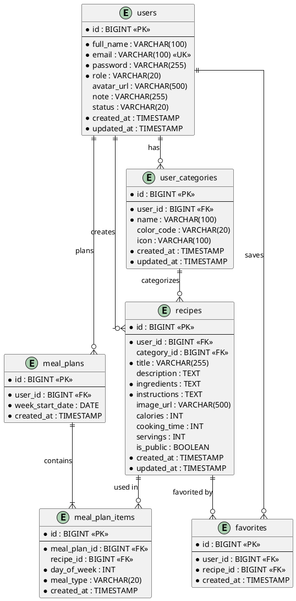

---

## CHƯƠNG 4: GIAO DIỆN

> **Lưu ý:** Chương 4 cần screenshots thực tế từ ứng dụng.
> Hãy chạy app, chụp màn hình các trang sau và đưa vào báo cáo:

### Danh sách Screenshots cần chụp:

1. **Hình 4.1. Giao diện đăng nhập**
   - URL: http://localhost:8080/login
   - Chụp full page

2. **Hình 4.2. Giao diện đăng ký**
   - URL: http://localhost:8080/register
   - Chụp full page

3. **Hình 4.3. Giao diện Công thức cá nhân**
   - URL: http://localhost:8080/app/home
   - Chụp danh sách recipes

4. **Hình 4.4. Giao diện Tạo/Chỉnh sửa công thức**
   - URL: http://localhost:8080/app/recipes/create
   - Chụp form

5. **Hình 4.5. Giao diện Chi tiết công thức**
   - URL: http://localhost:8080/app/recipes/{id}
   - Chụp recipe detail

6. **Hình 4.6. Giao diện Kế hoạch bữa ăn**
   - URL: http://localhost:8080/app/meal-plan
   - Chụp calendar view

7. **Hình 4.7. Giao diện Cộng đồng**
   - URL: http://localhost:8080/app/community
   - Chụp public recipes

8. **Hình 4.8. Giao diện Admin Dashboard**
   - URL: http://localhost:8080/admin/dashboard
   - Chụp admin page

9. **Hình 4.9. Email thông báo**
   - Check inbox
   - Chụp email nhận được

---

## Hướng dẫn sử dụng

### Cách tạo diagram từ PlantUML:

**Option 1: Online (Nhanh nhất)**
1. Vào https://www.plantuml.com/plantuml/uml/
2. Copy mã PlantUML
3. Paste vào editor
4. Download PNG hoặc SVG

**Option 2: VS Code Plugin**
1. Install extension "PlantUML"
2. Install Graphviz
3. Paste mã vào file .puml
4. Preview với Alt+D
5. Export PNG

**Option 3: IntelliJ IDEA Plugin**
1. Install "PlantUML integration"
2. Tạo file .puml
3. Paste code
4. Right-click → Export Diagram

### Tips cho báo cáo:

1. **Diagram size:** Export với độ phân giải cao (300 DPI)
2. **Naming:** Đặt tên file theo số hình (hinh_3_1.png)
3. **Placement:** Đưa hình vào đúng vị trí trong chương
4. **Caption:** Thêm caption dưới mỗi hình
5. **Reference:** Tham chiếu đến hình trong text: "như Hình 3.1 minh họa..."

---

**File này chứa tất cả UML diagrams cần thiết cho báo cáo!**
